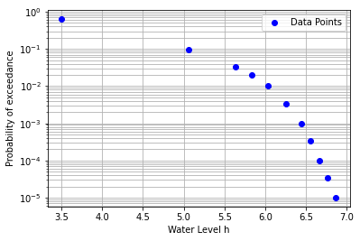
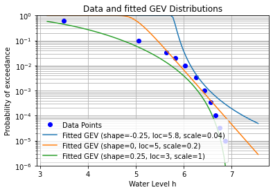
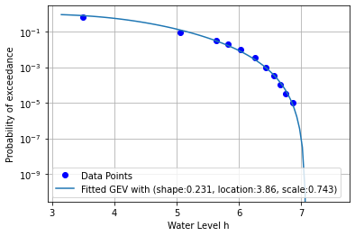
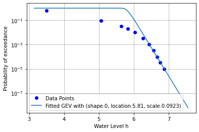

Tutorial 2: Fit an extreme value distribution for the water level
=================================================================

This example shows how to fit an extreme value probability distribution
from data of water levels and their return periods. This notebook
consists of the following steps: 1. Importing packages and data 2.
Importing the data from an external source 3. Preprocessing the data 4.
Visually checking the data 5. Fitting a Generalized Extreme Value (GEV)
distribution 6. Optimizing the distribution parameters using Python 7.
Plotting the result 8. Force fitting a Gumbel distribution

Step 1: Importing packages and data
-----------------------------------

In the next cell, we import the python packages necessary to run this
tutorial. We also print the versions.

.. code:: ipython3

    import numpy as np
    import scipy as sp
    import pandas as pd
    import matplotlib.pyplot as plt
    from scipy.stats import genextreme as gev
    from scipy.optimize import minimize
    print("numpy version {}".format(np.__version__))
    print("scipy version {}".format(sp.__version__))
    print("pandas version {}".format(pd.__version__))

.. parsed-literal::

    numpy version 1.22.4
    scipy version 1.8.1
    pandas version 1.5.3
    

Step 2: Importing the data from external source
-----------------------------------------------

To import the data, we specify the file path, and import the file with
the data. The data is automatically stored in a Pandas Dataframe.

.. code:: ipython3

    # Use Pandas to import the csv file. The headers are taken as column names
    df = pd.read_csv("input_waterlevels_returnperiod.txt", sep=",")

Step 3: Preprocessing of the data.
----------------------------------

To fit a probability distribution, we need to do some preprocessing. We
need to calculate a probability of exceedance from the return period.

The frequency of exceedance is :math:`f = 1/T` per year, and is
calculated for each water level :math:`h`.

The probability of exceedance is calculated as follows:
:math:`P(h>H)=1-\exp(-f)` to prevent probabilities larger than 1 for
frequencies larger than 1 per year.

.. code:: ipython3

    # Compute the freqency per yearand add it to the dataframe
    df['FrequencyPerYear'] = 1/df['ReturnPeriod']
    # Compute the exceedance probabilities from the frequency. 
    df['ExceedanceProbability'] = 1-np.exp(- df['FrequencyPerYear'])
    # Sort the water levels in ascending order
    df.sort_values('WaterLevel', ascending=True)

.. raw:: html

    

    
    <table border="1" class="dataframe">
      <thead>
        <tr style="text-align: right;">
          <th></th>
          <th>ReturnPeriod</th>
          <th>WaterLevel</th>
          <th>FrequencyPerYear</th>
          <th>ExceedanceProbability</th>
        </tr>
      </thead>
      <tbody>
        <tr>
          <th>0</th>
          <td>1</td>
          <td>3.50</td>
          <td>1.000000</td>
          <td>0.632121</td>
        </tr>
        <tr>
          <th>1</th>
          <td>10</td>
          <td>5.06</td>
          <td>0.100000</td>
          <td>0.095163</td>
        </tr>
        <tr>
          <th>2</th>
          <td>30</td>
          <td>5.64</td>
          <td>0.033333</td>
          <td>0.032784</td>
        </tr>
        <tr>
          <th>3</th>
          <td>50</td>
          <td>5.83</td>
          <td>0.020000</td>
          <td>0.019801</td>
        </tr>
        <tr>
          <th>4</th>
          <td>100</td>
          <td>6.03</td>
          <td>0.010000</td>
          <td>0.009950</td>
        </tr>
        <tr>
          <th>5</th>
          <td>300</td>
          <td>6.26</td>
          <td>0.003333</td>
          <td>0.003328</td>
        </tr>
        <tr>
          <th>6</th>
          <td>1000</td>
          <td>6.44</td>
          <td>0.001000</td>
          <td>0.001000</td>
        </tr>
        <tr>
          <th>7</th>
          <td>3000</td>
          <td>6.56</td>
          <td>0.000333</td>
          <td>0.000333</td>
        </tr>
        <tr>
          <th>8</th>
          <td>10000</td>
          <td>6.67</td>
          <td>0.000100</td>
          <td>0.000100</td>
        </tr>
        <tr>
          <th>9</th>
          <td>30000</td>
          <td>6.76</td>
          <td>0.000033</td>
          <td>0.000033</td>
        </tr>
        <tr>
          <th>10</th>
          <td>100000</td>
          <td>6.87</td>
          <td>0.000010</td>
          <td>0.000010</td>
        </tr>
      </tbody>
    </table>
    

Step 4: Visually checking the data
----------------------------------

Now we have the data points with the water level and the exceedance
probability for that water level. We plot the datapoints on a
logarithmic y-scale to judge if the data is logical.

The data in this example seems logical, viz. the exceedance
probabilities monotonously decrease with the waterlevel. Morover, we
observe that the last 5 points are rather linear (on a logarithmic
scale), and there seems to be a bend/kink in the data around a water
level of 6.25 m.

.. code:: ipython3

    def plot_waterdata(ax):
        '''
        Create a funtion to plot the waterdata, so we can later acess it again
        '''
        ax.semilogy(df['WaterLevel'], 
                    df['ExceedanceProbability'], 
                    'bo', label='Data Points')
        ax.set_xlabel('Water Level h')
        ax.set_ylabel('Probability of exceedance')
        ax.grid(which='both')
        ax.legend()
    
    ax = plt.subplot()
    plot_waterdata(ax)
    plt.show()

Step 5: Fitting a Generalized Extreme Value (GEV) distribution
--------------------------------------------------------------

Now we fit an extreme value distribution. We choose the Generalized
Extreme Value distribution.

We want to set the parameters of a GEV distribution such that the cdf
fits the data points. We can make a few tries and see how this works
out. With a few manual iterations, the result would not too bad after
all.

.. code:: ipython3

    def plot_GEV_cdf(ax, distribution_parameters):
        '''
        Create a funtion to plot the cdf, so we can later acess it again
        '''
        # Define a range of water levels for our fits
        # Base the bounds on the minimum and maximum of the data points.
        h_plotting_range = np.linspace(df['WaterLevel'].min()*0.9, 
                                       df['WaterLevel'].max()*1.1, 100)
    
        # For each guess, we calculate the cdf values for the given range
        p_exc_fit = gev.cdf(h_plotting_range, 
                            c = distribution_parameters['shape'], 
                            loc = distribution_parameters['location'], 
                            scale = distribution_parameters['scale'])
    
        # And plot the exceedance probability = 1 - cdf 
        ax.semilogy(h_plotting_range, 
                     1-p_exc_fit, 
                     label='Fitted GEV (shape={:.3g}, loc={:.3g}, scale={:.3g})'.format(
                         distribution_parameters['shape'],
                         distribution_parameters['location'],
                         distribution_parameters['scale']))
                
    # Re-instantiate the previous figure
    ax = plt.subplot()
    plot_waterdata(ax)
    
    # We define different guesses for the shape, location, and scale parameter. 
    # Note we have a Frechet (shape<1,), Gumbel (shape=0), and Weibull (shape>1). 
    # Note that the opposite convention of the sign of the shape parameter in scipy, compared 
    # to several other sources (e.g. Wikipedia) and software packages (Probabilistic Toolkit).
    distribution_parameters_list = [ 
        {'shape':-0.25, 'location':5.8, 'scale':0.04}, # Frechet
        {'shape':0.00, 'location':5.0, 'scale':0.2},   # Gumbel
        {'shape':0.25, 'location':3.0, 'scale':1.0}]   # Weibull
                                      
    # For each guess (distribution_parameter_set in distribution_parameter_set_list), 
    # calculate the cdf and plot it.
    for distribution_parameters in distribution_parameters_list:
        plot_GEV_cdf(ax, distribution_parameters)
    
    # Adjust the limits, and add labels
    plt.ylim([1e-6,1])
    plt.title('Data and fitted GEV Distributions')
    plt.legend()
    plt.savefig('GEV-fit.png', bbox_inches='tight')
    plt.show()
    print('Note the opposite convention of the sign of the shape parameter c in scipy, compared to several other sources (e.g. Wikipedia) and software packages (Probabilistic Toolkit).')

.. parsed-literal::

    Note the opposite convention of the sign of the shape parameter c in scipy, compared to several other sources (e.g. Wikipedia) and software packages (Probabilistic Toolkit).
    

Step 6: Optimizing the distribution parameters using Python
-----------------------------------------------------------

To optimize the distribution parameters, we create a loss function
``square_log_err``. We define the loss as the squared difference between
the :math:`P_{exc}` of the fitted GEV, and the :math:`P_{exc}` of the
data points. The loss depends on the distribution parameters of the GEV.
We take the logarithmic value of the differense, to prevent data points
in the tail having a negligible weigth.

The ``scipy.minimize`` function is used with an initial guess and bounds
for the distribution parameters to get the best combination of
parameters, for which the squared difference is the smallest.

.. code:: ipython3

    def square_log_err(params,):
        '''
        This function defines the sum of the squared log-differences 
        between P_exc of the fitted GEV, and the P_exc of the data points.
        Note that we use gev.sf as the survival function (=1-cdf), 
        and gev.logsf as the log of the survival function (=np.log(1-cdf)), 
        because it is numerically more accurate with values close to 0.0/1.0. 
        '''
        shape, loc, scale = params
        data_h=df['WaterLevel'].iloc[:]
        data_p=df['ExceedanceProbability'].iloc[:]
        log_pexc_fit = gev.logsf(data_h, c=shape, loc=loc, scale=scale)
        log_err =  log_pexc_fit - np.log(data_p)
        return np.sum(log_err**2)
    
    # The minimization needs an initial guess for the parameters
    # and bounds for the distribution parameters.
    initial_guess = [0.25, 3.0, 1.0]
    bounds=[(-1,1),(1,8),(0.01,5)]
    
    # Minimize squared difference to optimize the fit of the GEV distribution
    result_gev = minimize(square_log_err, initial_guess, bounds=bounds)
    
    # Extract the fitted parameters
    fitted_shape, fitted_location, fitted_scale = result_gev.x
    print("Fitted GEV: Shape, Location, Scale: {:.3g} {:.3g} {:.3g}".format(
        fitted_shape, fitted_location, fitted_scale))
    print("Note that for use in several other software packages (e.g. \n"
    "Probabilistic Toolkit), the opposite convention of the sign of \n"
    "the shape parameter c is used.")

.. parsed-literal::

    Fitted GEV: Shape, Location, Scale: 0.231 3.86 0.743
    Note that for use in several other software packages (e.g. 
    Probabilistic Toolkit), the opposite convention of the sign of 
    the shape parameter c is used.
    

Step 7: Plot the result
-----------------------

We show the cdf of the GEV with the optimized parameters in a graph

.. code:: ipython3

    # Re-instantiate the figure with water data
    ax = plt.subplot()
    plot_waterdata(ax)
    distribution_parameters = {'shape':fitted_shape, 
                               'location':fitted_location, 
                               'scale':fitted_scale}
    plot_GEV_cdf(ax, distribution_parameters)
    plt.legend()
    plt.show()

Step 8: Force fitting a Gumbel distribution
-------------------------------------------

Finally, we consider if we can fit a Gumbel distrubtion using only the
last 5 data points. The main reason is that these last 5 points seem
rather linear on a log-scale. A Gumbel distribution is a special
occasion of a GEV, which has shape parameter 0, and therefore is linear
on logarithmic scale. We might want to do this if only the tail of the
distribution is important.

A Gumbel distribution has shape parameter 0, so we put this as a
constraint for the mimization by adjusting the bounds.

Note that we also adjust the loss function, so it uses only the last 5
points!

.. code:: ipython3

    # For a Gumbel distribution, the shape parameter = 0, so adjust the bounds
    initial_guess = [0.0, 6.0, 0.1]
    bounds=[(0,0),(1,8),(0.01,1)]
    
    def square_log_err(params,):
        '''
        Define the logarithmic difference again. 
        However, note that only the last 5 datapoints are used
        '''
        shape, loc, scale = params
        data_h=df['WaterLevel'].iloc[-5:]
        data_p=df['ExceedanceProbability'].iloc[-5:]
        log_pexc_fit = gev.logsf(data_h, shape, loc=loc, scale=scale)
        log_err =  log_pexc_fit - np.log(data_p)
        return np.sum(log_err**2)
    
    # Make the fit
    result_gumbel = minimize(square_log_err, initial_guess, bounds=bounds)
    fitted_shape_gumbel, fitted_location_gumbel, fitted_scale_gumbel = result_gumbel.x
    print("Fitted Gumbel: Shape, Location, Scale: {:.3g} {:.3g} {:.3g}".format(
        fitted_shape_gumbel, fitted_location_gumbel, fitted_scale_gumbel))
    
    # Re-instantiate the figure with water data
    ax = plt.subplot()
    plot_waterdata(ax)
    distribution_parameters = {'shape':fitted_shape_gumbel, 
                               'location':fitted_location_gumbel, 
                               'scale':fitted_scale_gumbel}
    plot_GEV_cdf(ax, distribution_parameters)
    plt.legend()
    plt.show()

.. parsed-literal::

    Fitted Gumbel: Shape, Location, Scale: 0 5.81 0.0923
    

