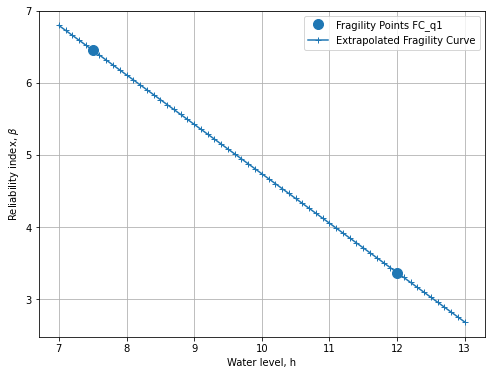
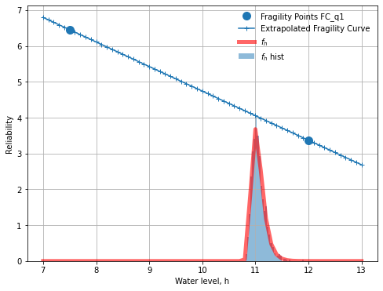

Tutorial 3: Integrating the fragility curve with the probability density function of the waterlevel, and derive influence coefficients after integration
~~~~~~~~~~~~~~~~~~~~~~~~~~~~~~~~~~~~~~~~~~~~~~~~~~~~~~~~~~~~~~~~~~~~~~~~~~~~~~~~~~~~~~~~~~~~~~~~~~~~~~~~~~~~~~~~~~~~~~~~~~~~~~~~~~~~~~~~~~~~~~~~~~~~~~~~

Create base ``class DStabilityFragilityCurve`` for fragility curve operations
^^^^^^^^^^^^^^^^^^^^^^^^^^^^^^^^^^^^^^^^^^^^^^^^^^^^^^^^^^^^^^^^^^^^^^^^^^^^^

.. code:: ipython3

    # Loading the necesary packages
    import json # for reading fragility curves in D-Stability .json format
    import numpy as np # for array calculations
    import scipy.stats as st # for statisitcal functions
    import pandas as pd # for reading excel files
    import matplotlib.pyplot as plt
    
    from scipy.interpolate import interp1d # for linear interpolation and extrapolation outside the range
    from statistics import NormalDist
    from scipy.stats import norm
    from scipy.stats import gumbel_r

.. code:: ipython3

    # Define some static functions
    
    def densify_extrapolate(x, y, xrange, xdelta):
        xnew = np.arange(xrange[0], xrange[1] + xdelta, xdelta)
        f = interp1d(x, y, kind='linear', bounds_error=False, fill_value='extrapolate')
        ynew = f(xnew)
        return xnew, ynew    
    
    # Preprocess the DStabilityFragilityCurve class
    class DStabilityFragilityCurve:
        
        def __init__(self, label, filename):
            """ --- documentation generated by AI model
            Initialize a DStabilityFragilityCurve object, and then
            calls `preprocess_rawdata()` to save the raw data in a structured way
    
            Args:
                label (str): The label for the DStabilityFragilityCurve object.
                filename (str): The name of the JSON file containing the raw data.
    
            Returns:
                None.
    
            Raises:
                FileNotFoundError: If the specified file does not exist.
    
            """     
            self.Label = label
            with open(filename, 'r') as f:
                self.rawdata = json.load(f)
            self.preprocess_rawdata()
            
        def preprocess_rawdata(self):
            """
            Notes
            """ 
            self.FragilityPoints = self.rawdata.get('Calculations')
            self.Stochasts = self.rawdata.get('Stochasts')
            self.Correlations = self.rawdata.get('Correlations')
            
            self.h = [point.get('WaterLevel') for point in self.FragilityPoints]
            self.b = [point.get('Beta') for point in self.FragilityPoints]
            self.bb =[ -1* point.get('Beta') for point in self.FragilityPoints]
            self.p = norm.cdf(self.bb)
            self.stochasts = {}
            for stochast in self.Stochasts:
                if stochast.get('ParameterType') == 'ModelFactor':
                    self.stochasts.update({stochast.get('Id'): stochast.get('ParameterType')})
                else:
                    self.stochasts.update({stochast.get('Id'): stochast.get('ParameterType')+
                                           '.'+stochast.get('Label')})
        
        def get_scenario_probability(self, file):
            # Import the scenario probabliity (weights) from excel file. 
            # Note the column headers match the labels of the fragility curve
            scenario_probability_data = pd.read_excel(file)
            self.scenario_h = np.array(scenario_probability_data['h'])
            self.scenario_p = np.array(scenario_probability_data[self.Label])
            
        def set_extrapolation_range_and_density(self, range_h, delta_h ):
            self.range_h = range_h
            self.delta_h = delta_h
              
        def densify_extrapolate_fc(self):
            # beta's
            self.H, self.B = densify_extrapolate(self.h, 
                                                 self.b, 
                                                 self.range_h, 
                                                 self.delta_h)
            self.HH, self.PP = densify_extrapolate(self.h, 
                                                   norm.cdf(self.bb), 
                                                   self.range_h, 
                                                   self.delta_h) 
            # alpha's 
            self.alphas={}
            self.Alphas={}
            for unique_stochast_name in set([val for key, val in self.stochasts.items()]):
                alphas = [contribution['Alpha'] for point in self.FragilityPoints 
                          for contribution in point.get('Contributions') 
                          if self.stochasts[contribution.get('Stochast')] == unique_stochast_name]
                H, Alphas = densify_extrapolate(self.h, alphas, self.range_h, self.delta_h)
                self.Alphas.update({unique_stochast_name:Alphas})
            
        def densify_extrapolate_p(self):
            self.H, self.P = densify_extrapolate(self.scenario_h, 
                                                 np.log10(self.scenario_p), 
                                                 self.range_h, self.delta_h)
            self.P = 10.**self.P
            

Specify the fragility curve names and locations. Instantiate a ``DStabilityFragilityCurve`` class and save in ``FC_list``
^^^^^^^^^^^^^^^^^^^^^^^^^^^^^^^^^^^^^^^^^^^^^^^^^^^^^^^^^^^^^^^^^^^^^^^^^^^^^^^^^^^^^^^^^^^^^^^^^^^^^^^^^^^^^^^^^^^^^^^^^

.. code:: ipython3

    # Specify the fragility curves in a List( tuple ( label [str] , filename [str] ) ) 
    fragility_curves_list = [ ('FC_q1','FC1.json' )]

.. code:: ipython3

    # Import Fragility curves and store the data in a DStabilityFragilityCurve object.
    FC_list = []
    for (fc_label, filename) in fragility_curves_list:
        FC = DStabilityFragilityCurve(fc_label, filename)
        FC_list.append( FC )

Plot the fragility points and the extrapolated fragility curve
^^^^^^^^^^^^^^^^^^^^^^^^^^^^^^^^^^^^^^^^^^^^^^^^^^^^^^^^^^^^^^

.. code:: ipython3

    # Choose the range to extrapolate the curves to, and the increment size for analysis
    range_h = [7,13]
    delta_h = 0.1
                
    for FC in FC_list:
        FC.set_extrapolation_range_and_density(range_h, delta_h)
        FC.densify_extrapolate_fc()

.. code:: ipython3

    def plot_fragility_curves(FC_list):
        # Instantiate a figure with a specified size
        fig = plt.figure(figsize=(8, 6))
        ax = fig.add_subplot(1, 1, 1)
            
        # Set the axis labels and title
        ax.set_xlabel('Water level, h')
        ax.set_ylabel(r'Reliability index, $\beta$')
    
        def plot_fragility_points(fig, h, b, label, color):
            # Add the fragility points to the figure
            ax.plot(h, b, color=color, marker='o', markersize=10, linestyle='none', 
                    label='Fragility Points {}'.format(label))
        
        def plot_extrapolated_fragility_curve(fig, h, b, label, color):
            # Add the fragility points to the figure
            ax.plot(h, b, color=color,  marker='+', linestyle='-', 
                    label='Extrapolated Fragility Curve')
         
        colors = ['tab:blue']
        for i, FC in enumerate(FC_list):
            c = colors[i]
            plot_fragility_points(fig, FC.h, FC.b, label=FC.Label, color=c)
            plot_extrapolated_fragility_curve(fig, h=FC.H, b=FC.B, label=FC.Label, color=c)
        
        plt.legend()
        plt.grid()
        return fig, ax
    
    # Create the figure
    fig, ax = plot_fragility_curves(FC_list)
    
    # Show the figure
    plt.show()

--------------

Now we integrate the fragility curve with the probability density of water level.

Here we assume the water level follows a Gumbel distribution.

.. code:: ipython3

    # Introduce the water level distribution function and plot 
    
    ## Parameters of the statistical distribution
    mu= 11 
    std = 0.1
    
    ## Calculating the pdf of the water level f(h); 
    xnew = np.arange(range_h[0], range_h[1]+delta_h, delta_h)
    fh = np.empty(len(xnew), dtype=object)
    
    ## Plot the Gumbel distribution and the fragility curve.
    r = gumbel_r.rvs(loc=mu, scale=std, size=1000)
    for h in range(len(xnew)):
        fh[h]=gumbel_r.pdf(xnew[h], loc=mu, scale=std)
    
    fig, ax = plot_fragility_curves(FC_list)
    plt.plot(xnew , fh,'r-', lw=5, alpha=0.6, label='$f_h$')
    plt.hist(r, density=True, bins='auto', histtype='stepfilled', alpha=0.5,label='$f_h$ hist' )
    plt.xlabel("Water level, h")
    plt.ylabel("Reliability")   
    plt.legend(loc='best', frameon=False)
    plt.show()

Calculating the probability of exceedence for range of H
^^^^^^^^^^^^^^^^^^^^^^^^^^^^^^^^^^^^^^^^^^^^^^^^^^^^^^^^

.. math ::

    P_f = \int P(F|h) . f_h(h) dh

.. code:: ipython3

    ## Calculating the f(h); 
    xnew = np.arange(range_h[0], range_h[1]+delta_h, delta_h)
    fh = np.empty(len(xnew), dtype=object)
    
    for h in range(len(xnew)):
        fh[h]=gumbel_r.pdf(xnew[h], loc=mu, scale=std)   #Gumbel distribution
    
    # Integrate f(h) with stepsize of delta_h -> 1
    sumFh = sum(fh)*delta_h
    print('Sum of $f_h$ = ', sum(fh)*delta_h )

.. parsed-literal::

    Sum of $f_h$ =  1.0006303391435327
    

.. code:: ipython3

    #print('The fragility curve is now desified over range {} with \
    # stepsize {}:'.format(range_h,delta_h))
    #print('H',FC_list[0].H)
    #print('Beta',FC_list[0].B)
    #print('Pf',norm.cdf(-1*FC_list[0].B)) #P(f/h)
    #print('fh',fh)  #f(h)
    
    P_fh = norm.cdf(-1*FC_list[0].B)                #P(f|h)        
    Pf = P_fh* fh * delta_h                         #P(f/h)*f(h)*delta    
    
    sumPf = sum(Pf)/sumFh
    print('Total failure probability after integration = %0.2e'%(sumPf))
    
    Beta = -1*norm.ppf(sumPf)                        #K2
    print('Reliability index after integration = %0.3f'%(Beta))

.. parsed-literal::

    Total failure probability after integration = 3.19e-05
    Reliability index after integration = 3.998
    

Calculating the influence coefficients after integration :math:`\alpha \_i \| h`
--------------------------------------------------------------------------------

.. math::

    \alpha_h = \frac{u^*}{ -\beta} =\frac{ \Phi^{-1}(F_h(h^*))} { \Phi^{-1}(P_f)}

    \Sigma_i \alpha_i^2 = \alpha_h^2 =1

    \alpha_{T_i} ^2 = (\alpha_i \|h^*)^2(1-\alpha_h^2)

where:

:math:`\alpha\_{T_i}` : transformed influence coefficient(s) of
strength variable

:math:`\alpha \_i \|h^*`: Influence coefficient(s) of strength
variable, directly from FORM at design point water level (e.g., based on
interpolation between fragility points)

.. code:: ipython3

    #calculating alphas in given design point water level (h_Star)
    Hs= 11.846                                         
    
    # Calculating u* for h*
    P_us=gumbel_r.pdf(Hs, loc=mu, scale=std)          # \Phi^{-1}(F_h(h*))
    us = st.norm.ppf(P_us)                           
    
    print('u*, design point (genormeerde waterstand) = ', us)
    print()
    alphaH = us/-Beta                                #alphaH = us/-Beta
    
    print('𝛼_ℎ (invloedscoëfficiënt van het waterstand) =', alphaH)
    print()
    #Getting alphas befor integrating for H^star ( interpolated through fragility curve)
    
    a=FC_list[0].Alphas                       
    for i in a.keys():                          
        values = np.array(list(a.values()))
    
    # to see the list of parameters
    #print(a.keys())                               
    
    # a function to find the related alpha set interpolated at given h*
    def find_nearest(array, value):                
        array = np.asarray(array)
        idx = (np.abs(array - value)).argmin()
        return idx
    
    idx = find_nearest(FC_list[0].H, value=Hs)    # Finding the related 𝛼𝑖|ℎ∗  based on the h*
    
    Alphas = np.zeros(len(values))
    for i in range(len(values)):
        Alphas[i]=values[i][idx]
        
    print('α_i |h^* = ', Alphas)    
    print()
    
    print('Sum of influence factors after integrating the probbaility of water level is: ',
          sum(Alphas**2)) 
    
    # check is equal to 1 if not we should normalize them.
    # warning:  The Alphas are not added upt to 1 ( error tolerance 1%) 
    # And your Alphas after integration are not reliable.

.. parsed-literal::

    u*, design point (genormeerde waterstand) =  -2.860139676806077
    
    𝛼_ℎ (invloedscoëfficiënt van het waterstand) = 0.7153517909441423
    
    α_i |h^* =  [ 0.05643247  0.          0.         -0.30353334  0.83616773  0.06107594
      0.34022656  0.          0.17395521]
    
    Sum of influence factors after integrating the probbaility of water level is:  0.9442383788975067
    

.. code:: ipython3

    # transformed influence coefficient(s) of parameters to be determined
    Alpha_T = Alphas**2*(1-alphaH**2)                
    print('The influence factors of strength paramters are:\n', Alpha_T)
    
    print()
    print('Influence factor from water level = ', 1-sum(Alpha_T))

.. parsed-literal::

    The influence factors of strength paramters are:
     [0.00155496 0.         0.         0.0449857  0.34138816 0.00182139
     0.05651947 0.         0.01477531]
    
    Influence factor from water level =  0.5389550127608109
    
