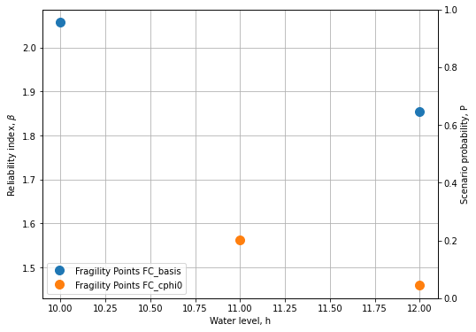
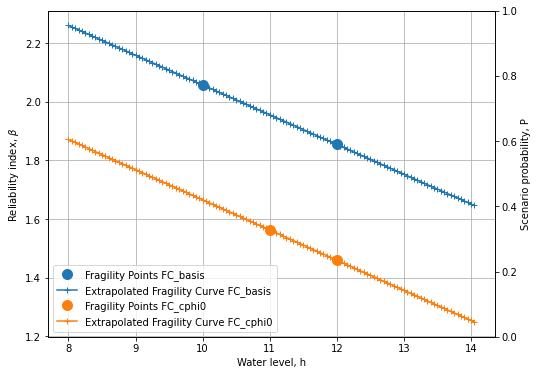
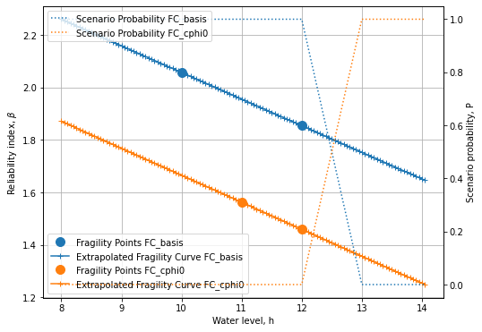
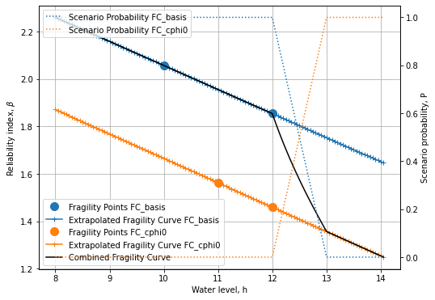

Tutorial 4: Combining 2 fragility curves for different scenario’s.
~~~~~~~~~~~~~~~~~~~~~~~~~~~~~~~~~~~~~~~~~~~~~~~~~~~~~~~~~~~~~~~~~~

We consider the slope reliability with a relatively thin blanket layer.

In the base case, the blanket layer has a strength, but in case of
uplift the strength reduces (to 0). For the latter, a scenario is
calculated with c/ph=0 in the uplift zone.

The water level at which uplift happens is uncertain. At low water
levels, the probability of uplift (and strength reduction) is rather
low, whereas at high water levels, the probability of uplift is high
(and thus the c/phi=0 scenario).

Import necessary python packages
^^^^^^^^^^^^^^^^^^^^^^^^^^^^^^^^

.. code:: ipython3

    import json # for reading fragility curves in D-Stability .json format
    import numpy as np # for array calculations
    import scipy.stats as st # for statisitcal functions
    import pandas as pd # for reading excel files
    from scipy.interpolate import interp1d # for linear inter- and extrapolation outside the range
    import matplotlib.pyplot as plt # for plotting

Load base class for Fragility curve operations
^^^^^^^^^^^^^^^^^^^^^^^^^^^^^^^^^^^^^^^^^^^^^^

.. code:: ipython3

    # A class for importing DStability Fragility curves
    class DStabilityFragilityCurve:
        
        # A static method in a class can be used without the the class-data. 
        # This method densifies and extrapolates a fragility curve
        @staticmethod 
        def densify_extrapolate(x, y, xrange, xdelta, fill_value='extrapolate'):
            xnew = np.arange(xrange[0], xrange[1] + xdelta, xdelta)
            f = interp1d(x, y, kind='linear', bounds_error=False, fill_value=fill_value)
            ynew = f(xnew)
            return xnew, ynew  
        
        def __init__(self, label, filename):
            '''
            - stores the given label
            - loads the json as raw data
            - initiates the preprocess_rawdata() method
            '''     
            self.Label = label
            with open(filename, 'r') as f:
                self.rawdata = json.load(f)
            self.preprocess_rawdata()
            
        def preprocess_rawdata(self):
            ''' 
            - preprocesses the raw data into a structure
            '''
            self.FragilityPoints = self.rawdata.get('Calculations')
            self.Stochasts = self.rawdata.get('Stochasts')
            self.Correlations = self.rawdata.get('Correlations')
    
            self.h = [point.get('WaterLevel') for point in self.FragilityPoints]
            self.b = [point.get('Beta') for point in self.FragilityPoints]
    
            # Make dictionary for translating Stochast Id to Label
            self.stochasts = {}
            for stochast in self.Stochasts:
                if stochast.get('ParameterType') == 'ModelFactor':
                    self.stochasts.update({stochast.get('Id'): stochast.get('ParameterType')})
                else:
                    self.stochasts.update({stochast.get('Id'): stochast.get('ParameterType') +
                                           '.' + stochast.get('Label')})
    
            for fragilitypoint in self.FragilityPoints:
                for contribution in fragilitypoint.get('Contributions'):
                    contribution.update({'Name': self.stochasts.get(contribution.get('Stochast'))})
    
            # cleanup for alpha values
            self.alphas = {}
            drop_list = [correlation_item.get('Stochast2') for correlation_item in self.Correlations]
            for unique_stochast_name in set([val for key, val in self.stochasts.items()]):
                alphas = [contribution['Alpha'] for point in self.FragilityPoints
                          for contribution in point.get('Contributions')
                          if (self.stochasts[contribution.get('Stochast')] == unique_stochast_name
                              and contribution.get('Stochast') not in drop_list ) ]
                self.alphas.update({unique_stochast_name: alphas})
                # final cleanup
                self.alphas = {key: val for key, val in self.alphas.items() if val}
    
        def get_scenario_probability(self, file):
            '''
            Import the scenario probabliity (weights) from excel file. 
            Note the column headers match the labels of the fragility curve
            in the format P({self.Label})
            '''
            scenario_probability_data = pd.read_excel(file)
            self.scenario_h = np.array(scenario_probability_data['h'], dtype=float)
            self.scenario_p = np.array(scenario_probability_data[f'P({self.Label})'], dtype=float)
            
        def set_extrapolation_range_and_density(self, range_h, delta_h ):
            self.range_h = range_h
            self.delta_h = delta_h
              
        def densify_extrapolate_fc(self):
            # For the beta's
            self.H, self.B = DStabilityFragilityCurve.densify_extrapolate(self.h, 
                                                                          self.b, 
                                                                          self.range_h, 
                                                                          self.delta_h)
            # For the alpha's
            self.Alphas={}
            for unique_stochast_name, alphas in self.alphas.items():
                H, Alphas = DStabilityFragilityCurve.densify_extrapolate(self.h, 
                                                                         alphas, 
                                                                         self.range_h, 
                                                                         self.delta_h)
                self.alphas.update({unique_stochast_name: alphas})
                self.Alphas.update({unique_stochast_name: Alphas})
            
        def densify_extrapolate_scenario_probability(self, logarithmic=True):
            if logarithmic:
                self.scenario_p[self.scenario_p<(1e-9)] = 1e-9
                self.scenario_p[self.scenario_p>(1-1e-9)] = 1-1e-9
            
                self.H, self.P = DStabilityFragilityCurve.densify_extrapolate(self.scenario_h, 
                                                                          np.log10(self.scenario_p), 
                                                                          self.range_h, 
                                                                          self.delta_h)
                self.P = pd.Series(10.**self.P).bfill().ffill().to_numpy()
            else:
                self.H, self.P = DStabilityFragilityCurve.densify_extrapolate(self.scenario_h, 
                                                                          self.scenario_p, 
                                                                          self.range_h, 
                                                                          self.delta_h)
            

Code for plotting
^^^^^^^^^^^^^^^^^

.. code:: ipython3

    def plot_fragility_curves(FC_list, figures_to_plot):
        # Instantiate a figure with a specified size
        fig = plt.figure(figsize=(8, 6))
        ax = fig.add_subplot(1, 1, 1)
        ax2 = ax.twinx()
            
        # Set the axis labels and title
        ax.set_xlabel('Water level, h')
        ax.set_ylabel(r'Reliability index, $\beta$')
        ax2.set_ylabel(r'Scenario probability, P')
    
        def plot_fragility_points(fig, h, b, label, color):
            # Add the fragility points to the figure
            ax.plot(h, b, color=color, marker='o', markersize=10, linestyle='none', 
                    label=f'Fragility Points {label}' )
        
        def plot_extrapolated_fragility_curve(fig, h, b, label, color):
            # Add the fragility curve to the figure
            ax.plot(h, b, color=color,  marker='+', linestyle='-', 
                    label=f'Extrapolated Fragility Curve {label}')
    
        def plot_scenario_probability(fig, h, p, label, color):
            # Add the scenario probability to the figure
            # ax2.stackplot(h, p)
            ax2.plot(h, p, color=color,  marker='None', linestyle=':', 
                     label=f'Scenario Probability {label}')
         
        colors = ['tab:blue','tab:orange','tab:green','tab:red','tab:purple',
                  'tab:brown','tab:pink','tab:gray','tab:olive','tab:cyan']
        
        for i, FC in enumerate(FC_list):
            c = colors[i]
            if 1 in figures_to_plot:
                plot_fragility_points(fig, FC.h, FC.b, label=FC.Label, color=c)
                ax.legend(loc=3)
                ax.grid('on')
            if 2 in figures_to_plot:
                plot_extrapolated_fragility_curve(fig, h=FC.H, b=FC.B, label=FC.Label, color=c)
                ax.legend(loc=3)
            if 3 in figures_to_plot:
                plot_scenario_probability(fig, h=FC.H, p=FC.P, label=FC.Label, color=c)
                ax2.legend(loc=2)
        
        return fig, ax

Load fragility curves, create DStabilityFragilityCurve objects, and save in list
--------------------------------------------------------------------------------

.. code:: ipython3

    fragility_curves_list = [ ('FC_basis','FC_tutorial_basis.json' ),
                               ('FC_cphi0','FC_tutorial_cphi0.json' )]
    FC_list = []
    for (fc_label, filename) in fragility_curves_list:
        FC = DStabilityFragilityCurve(fc_label, filename)
        FC_list.append( FC )

Plot the fragility points
^^^^^^^^^^^^^^^^^^^^^^^^^

.. code:: ipython3

    # Create the figure
    fig, ax = plot_fragility_curves(FC_list, [1])
    # Show the figure
    plt.show()

Extrapolate fragility curves linearly along the given range, with the given discretisation
^^^^^^^^^^^^^^^^^^^^^^^^^^^^^^^^^^^^^^^^^^^^^^^^^^^^^^^^^^^^^^^^^^^^^^^^^^^^^^^^^^^^^^^^^^

.. code:: ipython3

    range_h = [8,14]
    delta_h = 0.05
    
    for FC in FC_list:
        FC.set_extrapolation_range_and_density(range_h, delta_h)
        FC.densify_extrapolate_fc()

Plot the extrapolated fragility curves
^^^^^^^^^^^^^^^^^^^^^^^^^^^^^^^^^^^^^^

.. code:: ipython3

    # Create the figure
    fig, ax = plot_fragility_curves(FC_list, [1,2])
    # Show the figure
    plt.show()

Load the water level dependent scenario probability and densify and extrapolate
^^^^^^^^^^^^^^^^^^^^^^^^^^^^^^^^^^^^^^^^^^^^^^^^^^^^^^^^^^^^^^^^^^^^^^^^^^^^^^^

.. code:: ipython3

    for FC in FC_list:
        FC.get_scenario_probability('ScenarioProbabilityFragilityCurvesUplift_2.xlsx')
        # Note we linearly extrapolate the logarithmic values of the probability
        FC.densify_extrapolate_scenario_probability(logarithmic=False)

Sanity checks:
^^^^^^^^^^^^^^

.. code:: ipython3

    # Check if all arrays in the list are identical
    h_array_identical = all(all(array.H == FC_list[0].H) for array in FC_list)
    
    # Check if all scenario probabilies sum to 1 with precision 0.001
    sum_to_one_bool = np.abs(np.nansum( [FC.P for FC in FC_list], axis=0) -1 ) < 1e-3
    scenarios_exhaustive = all(sum_to_one_bool)
    
    if not h_array_identical:
        print("Arrays in the list are not identical. Correct the extrapolation bounds")
    if not scenarios_exhaustive:
        print("Scenario probabilies do not sum to 1.0. I.e. the scenarios are not \n"
        "collectively exhaustive. Correct the scenario probabilities.")
        print(FC_list[0].H[~sum_to_one_bool])
        for FC in FC_list:
            print(FC.P[~sum_to_one_bool])

Plot the scenario probabilities
^^^^^^^^^^^^^^^^^^^^^^^^^^^^^^^

.. code:: ipython3

    # Create the figure
    fig, ax = plot_fragility_curves(FC_list, [1,2,3])\
    # Show the figure
    plt.show()

The combination of 2 fragility curves
^^^^^^^^^^^^^^^^^^^^^^^^^^^^^^^^^^^^^

.. code:: ipython3

    if h_array_identical and scenarios_exhaustive:
        # Combine all curves with the respective scenario probabilities 
        Pf_combined = np.sum( [FC.P * st.norm.cdf(- FC.B ) for FC in FC_list], axis=0)
        beta_combined = -1*st.norm.ppf(Pf_combined)
        h_combined = FC_list[0].H
        
        # Get weighted alpha's for all unique stochasts
        stochast_names=[]
        
        for FC in FC_list:
            stochast_names.extend(list(FC.Alphas.keys()))
        alphas_combined={}
        
        for unique_stochast_name in set(stochast_names):
            alpha_combined = np.nansum( 
                [FC.P * FC.Alphas[unique_stochast_name] for FC in FC_list], axis=0)
            alphas_combined.update({unique_stochast_name:alpha_combined})
            
        normalization_factor = np.nansum(
            [arr**2 for key, arr in alphas_combined.items()],axis=0)
        
        for key,arr in alphas_combined.items():
            arr/=np.sqrt(normalization_factor)
            
        if not all(np.abs(np.nansum(
            [arr**2 for key, arr in alphas_combined.items()],axis=0)-1) < 1e-3) :
            print('Something is wrong with the normalization of alpha-factors')
            print(alphas_combined)    

Plot the combined fragility curve
^^^^^^^^^^^^^^^^^^^^^^^^^^^^^^^^^

.. code:: ipython3

    fig, ax = plot_fragility_curves(FC_list, [1,2,3])
    ax.plot(h_combined, beta_combined, color='k', linestyle='-', label='Combined Fragility Curve')
    ax.legend(loc=3)
    plt.show()

Save the combined fragility curve to json (e.g. to import in the Probabilistic Toolkit)
^^^^^^^^^^^^^^^^^^^^^^^^^^^^^^^^^^^^^^^^^^^^^^^^^^^^^^^^^^^^^^^^^^^^^^^^^^^^^^^^^^^^^^^

.. code:: ipython3

    # Store the combined fragility curve to json.
    alpha_values = []
    stochasts = []
    i=0
    for stochast_name, arr in alphas_combined.items():
        alpha_values.append(arr)
        stop = False
        while not stop:
            for FC in FC_list:
                while not stop:
                    for stochast in FC.Stochasts:
                        if stochast['ParameterType']+"."+stochast['Label'] == stochast_name:
                            stochast['Id'] = str(i)
                            stochasts.append(stochast)
                            stop = True
                            break
                        elif stochast['ParameterType'] == 'ModelFactor' and \
                                         stochast_name == 'ModelFactor':
                            stochasts.append(stochast)
                            stochast['Id'] = str(i)
                            stop = True
                            break
        i+=1
    
    json_out = {"Calculations": [{"Label":"FC combined", 
                                  "Beta":b, 
                                  "WaterLevel":h, 
                                  "Contributions":[{'Stochast': str(i),
                                                    'Alpha':a} for i,a in enumerate(alphas)]
                                 } for h,b,alphas in zip(h_combined, 
                                                         beta_combined, 
                                                         np.array(alpha_values).T)],
                "Stochasts":    stochasts ,
                "Correlations": []}
    
    with open('Combined_FC.json', 'w') as f:
        json.dump(json_out, f, indent=2)
    
