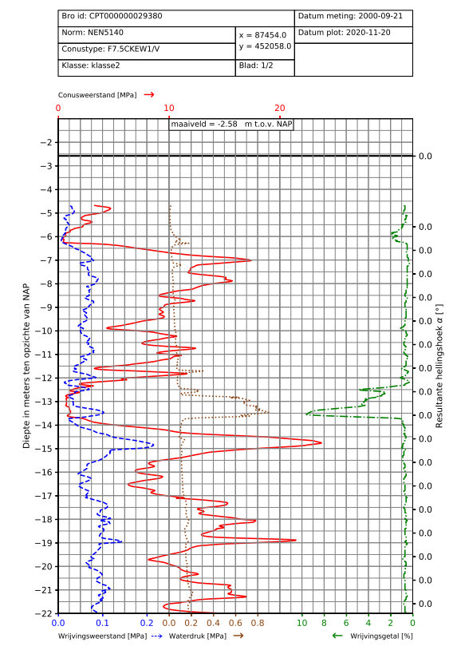

.. tutorialcpt:

Tutorial Cpt plotting using GEOLIB+
=========================================

After the cpt is set up by following the steps described in:

.. toctree::
   :maxdepth: 3

   tutorial_setup_cpt

The user can plot a cpt by following the next step:

1. The plotting method  :func:`~geolib_plus.cpt_base_model.AbstractCPT.plot` can be called to plot and save the figure.
This function works for cpts based on xml-bro files and based on gef files.
Before the function can be called, it is required to define the directory where the figures will be saved.
Below an example is given on how the data of the cpt can be plotted.

.. code-block:: python

    from pathlib import Path

    output_path = Path(".")
    cpt.plot(self, output_path)

A figure of a typical cpt plot is shown below:

2. The cpt is plotted with default settings. If you wish to alter the default plotting settings. The user can alter the
plot_settings attribute in :class:`~geolib_plus.cpt_base_model.AbstractCPT` class. For a complete documentation on the plot settings, see:
:class:`~geolib_plus.plot_settings.PlotSettings`. Below an example is given on how the colour of the cone resistance is altered:

.. code-block:: python

    cpt.plot_settings.plot_qc_settings["graph_color"] = "blue"
    cpt.plot(output_path)

3. It might be desired to plot the inversed friction number instead of the regular friction number. This can give more
insight in the lower values of the data. Below it is shown how the inversed friction angle can be presented.

.. code-block:: python

    cpt.plot_settings.set_inversed_friction_number_in_plot()
    cpt.plot(output_path)

This option can be reversed with the following function:

.. code-block:: python

    cpt.plot_settings.set_friction_number_in_plot()

