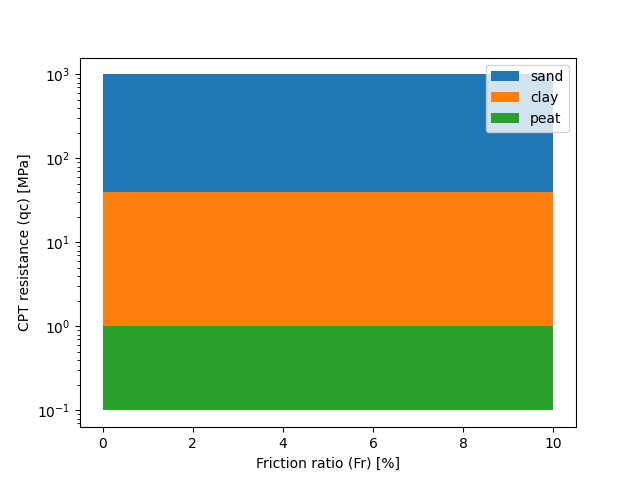
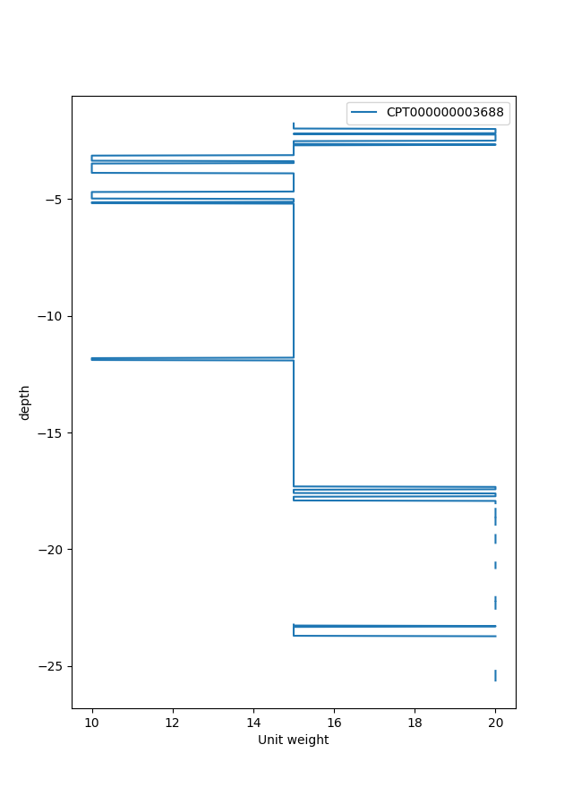

.. tutorialcpt:

Tutorial  Custom Cpt interpretation using GEOLIB+
=================================================

Following this tutorial the user can learn how to create a custom interpretation class using GEOLIB+.
Because the :class:`~geolib_plus.robertson_cpt_interpretation.robertson_cpt_interpretation.RobertsonCptInterpretation` class 
might not have specific functionalities desired by the user.

In the following example, a custom cpt interpretation method is created called "qc only rule". In this example, the
classification of the soil depends solely on the cpt cone resistance. In this example, the user wants to fulfill the
following two requirements:

 * The class must be able to classify the soil into "clay", "peat" and "sand" based on a provided shapefile.
 * The class must be able to determine the unit weight of the soil based on the soil classification.

In the following figure, a visual representation
of the new interpretation model is presented after plotting it.

As a first step the user creates a shapefile that represents the qc-only classification method.
The user can do this by using the following python code:

.. code-block:: python

        from pathlib import Path
        from shapely import geometry
        import shapefile

        # define points
        A = geometry.Point(0, 0.1)
        B = geometry.Point(10, 0.1)
        C = geometry.Point(0, 1)
        D = geometry.Point(10, 1)
        E = geometry.Point(0, 40)
        F = geometry.Point(10, 40)
        G = geometry.Point(0, 1000)
        H = geometry.Point(10, 1000)
        # define polygons
        polygon_sand = geometry.Polygon([[p.x, p.y] for p in [G, H, F, E]])
        polygon_clay = geometry.Polygon([[p.x, p.y] for p in [E, F, D, C]])
        polygon_peat = geometry.Polygon([[p.x, p.y] for p in [C, D, B, A]])
        shapefile_polygon = {
            "sand": polygon_sand,
            "clay": polygon_clay,
            "peat": polygon_peat,
        }
        # write shapefile
        shapefile_location = Path("qc_only_rule")
        w = shapefile.Writer(shapefile_location)
        w.field("name", "C")
        final_list = []
        for key, value in shapefile_polygon.items():
            final_list.append(list(zip(value.exterior.xy[0], value.exterior.xy[1])))
            w.poly([list(zip(value.exterior.xy[0], value.exterior.xy[1]))])
            w.record(key)
        w.close()

The user can also check if the shapefile contains the correct geometry by plotting it.

.. code-block:: python

    import matplotlib.pyplot as plt

    # Plot Shape file
    sf = shapefile.Reader(Path('qc_only_rule'))
    print('number of shapes imported:', len(sf.shapes()))
    plt.figure()
    for shape in list(sf.iterShapeRecords()):
        x_lon, y_lat = zip(*shape.shape.points)
        plt.fill(x_lon, y_lat, label=shape.record.name)
    plt.xlabel("Friction ratio (Fr) [%]")
    plt.ylabel("Cone resistance (qc) [MPa]")
    plt.yscale('log')
    plt.legend()
    plt.show()

Then the user should make their own custom interpretation class which should inherit for the :class:`~geolib_plus.cpt_base_model.AbstractInterpretationMethod`.
In the following example the class created is named **CustomCptInterpretation**, this class inherits from both 
:class:`~geolib_plus.cpt_base_model.AbstractInterpretationMethod` and BaseModel. 

The properties of this class are:

 * cpt_data: Which contains the cpt data as read by GEOLIB+
 * soil_types_for_classification: Which is a dictionary of values that are read from the soil classification shapefile.
 * path_shapefile: The path to the soil classification shapefile.
 * unit_weight_soil: A list of the final unit weight results

Apart from that there are three different functions included in the **CustomCptInterpretation** class.
The function **interpret** is the one that should always be defined by the user as it is also part of
the :class:`~geolib_plus.cpt_base_model.AbstractCPT` class.

.. note::  To find out more about the concept of inheritance in python see <https://docs.python.org/3/tutorial/classes.html> and <https://www.w3schools.com/python/python_inheritance.asp> .

.. code-block:: python

    from typing import Dict, List, Optional
    from geolib_plus.cpt_base_model import AbstractInterpretationMethod, AbstractCPT
    from pathlib import Path
    import shapefile
    from pydantic import BaseModel

    class CustomCptInterpretation(AbstractInterpretationMethod, BaseModel):
        cpt_data: AbstractCPT = None
        soil_types_for_classification: Dict = {}
        path_shapefile: Optional[Path] = None
        unit_weight_soil: List = []

        def interpret(self, cpt: AbstractCPT):
            """
            Function that interprets the cpt inputs.
            Lithology for each layer is determined according to
            the qc only method. Note that the pre_process method
            should be run before the interpret method.
            """
            # import cpt
            self.cpt_data = cpt
            # Perform unit transformations
            self.cpt_data.tip = self.cpt_data.tip * 100
            MPa_to_kPa = 1000
            self.cpt_data.friction = self.cpt_data.friction * MPa_to_kPa
            # read soil classification from shapefile
            self.soil_types()
            # calculate lithology
            self.lithology()
            # calculate unit weights based on the lithology found
            self.unit_weight()

        def unit_weight(self):
            """
            Function that determines the unit weight of different soil types depending
            on the classification type.
            """
            unit_weight = []
            typical_unit_weight_sand = 20
            typical_unit_weight_clay = 15
            typical_unit_weight_peat = 10
            for soil_type in self.cpt_data.lithology:
                if soil_type == "sand":
                    unit_weight.append(typical_unit_weight_sand)
                elif soil_type == "clay":
                    unit_weight.append(typical_unit_weight_clay)
                elif soil_type == "peat":
                    unit_weight.append(typical_unit_weight_peat)
                else:
                    unit_weight.append(None)
            self.unit_weight_soil = unit_weight

        def point_intersects_one_polygon(self, point):
            for soil_name, polygon in self.soil_types_for_classification.items():
                if polygon.contains(point):
                    return soil_name
            return None

        def lithology(self):
            """
            Function that reads a soil classification shapefile.
            """
            # determine into which soil type the point is
            lithology = []
            for counter in range(len(self.cpt_data.friction)):
                point_to_check = geometry.Point(
                    self.cpt_data.tip[counter], self.cpt_data.friction[counter]
                )
                lithology.append(self.point_intersects_one_polygon(point_to_check))
            self.cpt_data.lithology = lithology

        def soil_types(self):
            """
            Function that read shapes from shape file and passes them as Polygons.
            """

            # read shapefile
            sf = shapefile.Reader(str(self.path_shapefile))
            for polygon in list(sf.iterShapeRecords()):
                self.soil_types_for_classification[polygon.record.name] = geometry.Polygon(
                    polygon.shape.points
                )

After defining the custom class the user can use it in the following way.
First of all, the user has to read a cpt and perform a pre_process calculation:

.. code-block:: python

    from geolib_plus.gef_cpt import GefCpt
    from pathlib import Path
    cpt_file_gef = Path("cpt", "gef", "test_cpt.gef")
    # initialize models
    cpt_gef = GefCpt()
    # read the cpt for each type of file
    cpt_gef.read(cpt_file_gef)
    # do pre-processing of the gef file
    cpt_gef.pre_process_data()

Secondly, the interpret class should be called and the interpretation can be performed.

.. code-block:: python

    # call custom interpretation class
    interpreter = CustomCptInterpretation()
    interpreter.path_shapefile = Path("qc_only_rule.shp")
    # use GEOLIB+ to run interpreter
    cpt.interpret_cpt(interpreter)

After the interpretation is performed the user can inspect the results. Plotting them is an easy method to inspect the outcomes.
To do that use the following code block.

.. code-block:: python

    import matplotlib.pyplot as plt
    plt.figure()
    plt.plot(
        interpreter.unit_weight_soil,
        cpt.depth_to_reference,
        label=cpt.name,
    )
    plt.xlabel("Unit weight")
    plt.ylabel("depth")
    plt.legend()
    plt.show()

The final plot can be observed after the interpretation is performed.

